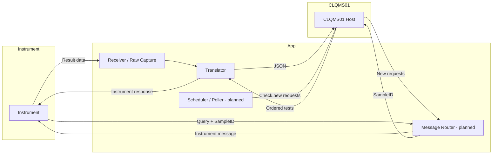

# TinyLink Integration Design

## Overview
TinyLink is a bi-directional integration hub between laboratory instruments and the CLQMS01 host. It receives instrument results, wraps raw payloads into a canonical envelope, translates them to JSON, and pushes them to CLQMS01. It also retrieves test requests from CLQMS01 and delivers them to instruments through download and query workflows (planned).

## Goals
- Provide reliable, automated data exchange between instruments and CLQMS01.
- Normalize and translate messages between instrument formats and JSON for CLQMS01.
- Support both download (new requests) and query (SampleID) workflows.

## Non-Goals
- User interface or manual data entry.
- Business rule orchestration beyond mapping and routing.
- Long-term analytics or reporting.

## High-Level Architecture

## Data Flows
- Result flow (Instrument → CLQMS01): receive instrument output, wrap raw payload into a canonical envelope, translate to JSON, send to CLQMS01.
- Download request flow (CLQMS01 → Instrument): poll CLQMS01 for new requests, map to instrument message, send to instrument. (planned)
- Query flow (Instrument → CLQMS01 → Instrument): instrument sends query with SampleID, fetch ordered tests from CLQMS01, translate to instrument response, send back. (planned)

## Current vs Planned
- Current: result ingest → raw capture → translator → queue → delivery worker → CLQMS01.
- Planned: scheduler/poller for download requests and message router for download/query workflows.

## Key Components
- Receiver/Raw Capture: accepts instrument output and records it as raw payload for translation.
- Translator: maps instrument fields to JSON schema and vice versa.
- Message Router: routes messages to the correct workflow and destination. (planned)
- Scheduler/Poller: periodically checks CLQMS01 for new requests. (planned)
- CLQMS01 Adapter: handles request/response and authentication to the host.

## Reliability and Error Handling
- Retry on transient network failures.
- Log and flag translation/normalization errors with raw payload references.
- Idempotency safeguards for resends when possible.

## Security and Configuration
- CLQMS01 host and API key stored in config.
- Instrument connection details stored in config.
- No secrets committed to source control.
